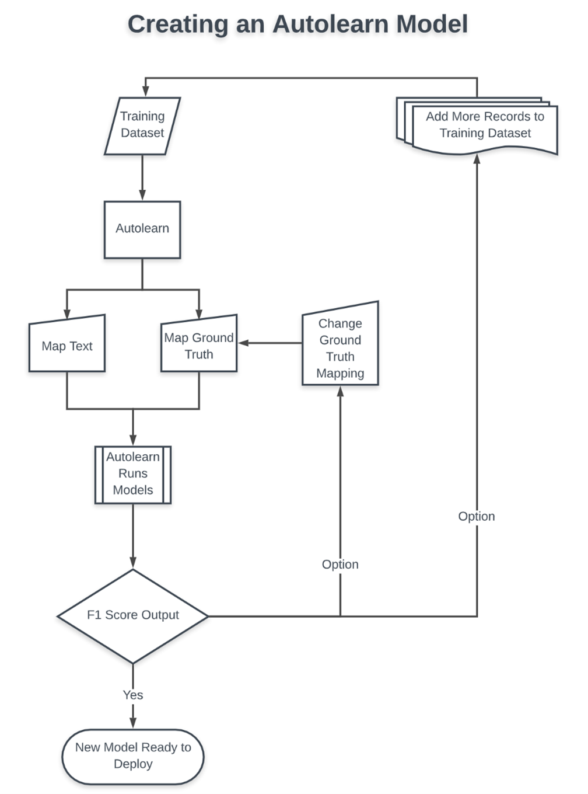

# AutoLearn

AutoLearn builds custom machine learning models based on your data and chooses the most suitable ensemble of models based on the F1 score. After training the model with your data, you can apply the model to a new data stream that has the same input dimensions and similar data.

## Why to use it

If you are unsure of which supervised model's algorithm is best suited to your data, choose AutoLearn, as it compares results from each algorithm and determines which gets the best results. This does take more time, so if you are certain about which algorithm you need, use the appropriate supervised model for faster results.

## How it works

We train a model to predict the categories or Key Performance Indicators (KPIs) of unlabeled or unscored records. For training, we use a sample from a large dataset. Once the model is trained, you can apply its findings either to the large dataset itself, or to other datasets with text similar to the training dataset.

After pre-processing we have up to three types of feature vectors, and AutoLearn can train the classification model. It tests 20% of the training data against the other 80%, running all of the following machine learning (ML) models.

1.	Random Forest
2.	Feedforward Neural Network
3.	Logistic Regression
4.	Semi-Automatic Taxonomy
5.	Embedding attentive model (LEAM)
6.	Support Vector Machine
7.	ZSL model

AutoLearn evaluates the performance of each model, as well as an ensemble of the models, using a weighted average of F1 scores for each, and then selects the model or ensemble of models that has the highest F1 score in predicting the KPI or Category field.

An F1 score is an Inference Score, a proxy for accuracy. In other words, the F1 score does not guarantee that this model is 75% accurate at predicting labels or KPIs on every data stream, only that it was 75% accurate with the training data. (To find the actual accuracy of an AutoLearn model, you would need to hand score every field, so we implicitly trust the F1 score.)

Accuracy is dependent on the amount of data in the training dataset provided to the AutoLearn model. If you only use 300 records for training and then apply it to a data stream with 300,000 records, the results may be disappointing even if the F1 score is high for the 300 records. It is best not to apply an AutoLearn model trained on a small number records to a huge amount of data unless you are completely confident that the textual data in the large dataset is very similar in nature to the training dataset.

Stratifyd supplies a built-in Neural Sentiment model, an AutoLearn model that is pre-trained on 40 million customer reviews, that you can use for data that is similar to a customer review.

When you deploy the AutoLearn model to a data stream that is similar to the training data stream, it generates results that you can then reincorporate into your AutoLearn model, adding more records to the training dataset and making it smarter and bigger and better over time.

## Input fields

The model requires one Ground Truth field and at least one Unstructured Text or Training Feature field.

-	**Ground Truth**: a field that objectively measures how the user feels, such as a star rating
-	**Unstructured Text**: a field that collects free-form user feedback, that is, they type it rather than select from a list
-	**Training Feature**: a field that collects structured user data, that is, data that is numerical or that is selected from options 

## Output fields 

The AutoLearn Model returns the following fields for use in widget visualizations.

| Field	| Description |
|-|-|
| confidence |	The confidence level about the accuracy of the prediction on a scale of 0 to 100. |
| keywords |	A textual array of the most important words within the data stream. In supervised models, keywords are the terms that the model finds and uses to predict each label. Keywords are only generated if you select an Unstructured text field. If you select only a Training Feature, that is, selectable values, dates, or numbers, no keywords are generated. |
| label |	The predicted output based on what the model learned from your input data. |
| language.code |	The two-letter language code of the detected language, e.g. en, fr, jp. See Language detection for more information. |
| language.name |	The full name of the detected language, e.g. English, French, Japanese. |
| tokenized |	A list of every word detected in the corpus. This is trivial for languages that use spaces between words, but for languages in which there are no spaces between words and multi-character words are possible, each requires a custom tokenizer. |
| unigrams |	A textual array of single words within the data stream. Stratifyd calculates the total number of words and the number of unique values. Useful in a word cloud viewed with filters on average sentiment. |
| data |	A table containing all of the original data from the data stream, plus all of the analyzed data from the model. |

## To create an AutoLearn model

You can create a model from within a dashboard, or you can add one to the Models page.

-	Create from dashboard
-	Create from Models page

## Advanced settings

You can set the following properties in the Advanced section of the Create a new model or Deploy a new model dialog. 

| Setting |	Description | Default value | Valid values | More information |
|-|-|-|-|-|
| Ratio of training to validation set |	The ratio that determines how much of the dataset is used as a training set and how much is used to validate the results. |  0.2 (80/20) | 90/10, 80/20, 70/30, 60/40 | |
| Minimum number of records for a field |	Set the minimum number of records for a field to be considered for analysis. This prunes any classes with fewer records than the value you set here. |	0 | | |
| Resampling | If your data is skewed towards one class or another, you can resample your data and adjust the class distribution for better results. | none | Over sample, Under sample | See **Oversampling and undersampling in data analysis** in Wikipedia for more information. |
| Apply training filter to analysis |	Apply your custom data training filter to your analysis results.| true | true, false | See **Add Filter** below. |
| Run Language Detection | Run language detection on the source text. | true | | |
| Default Language | Assume this language if language detection fails. This is used to select a language-specific stopword list to apply to clean text. | English | | |
| Stopwords | Apply custom stopword lists to remove non-informative words from categorization. | | | See **Customize stopwords dictionaries** for more information. |
| Chinese Dictionary | Customize Chinese tokens that our engine uses when creating key n-grams in your analysis. | | | See **Customize Chinese token dictionaries** for more information. |
| Schedule Model Retrain | Specify the number of days, weeks, months, or years after which to retrain your model. | | | |
| Add Filter | Select a field on which to filter training data. | | | If **Apply training filter to analysis** is selected above, the filter also applies to your analysis results. |

See also

-	Supervised models
-	Unsupervised NLU model
-	Basic analyses
-	Creating a dashboard
-	Concepts and best practices
-	Stratifyd documentation overview
