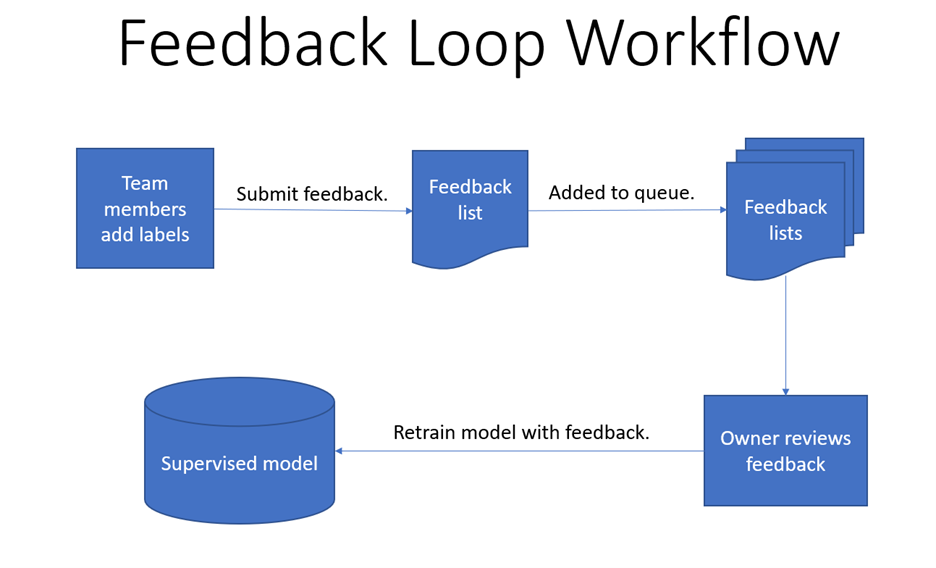
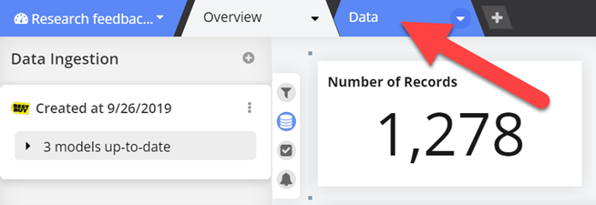
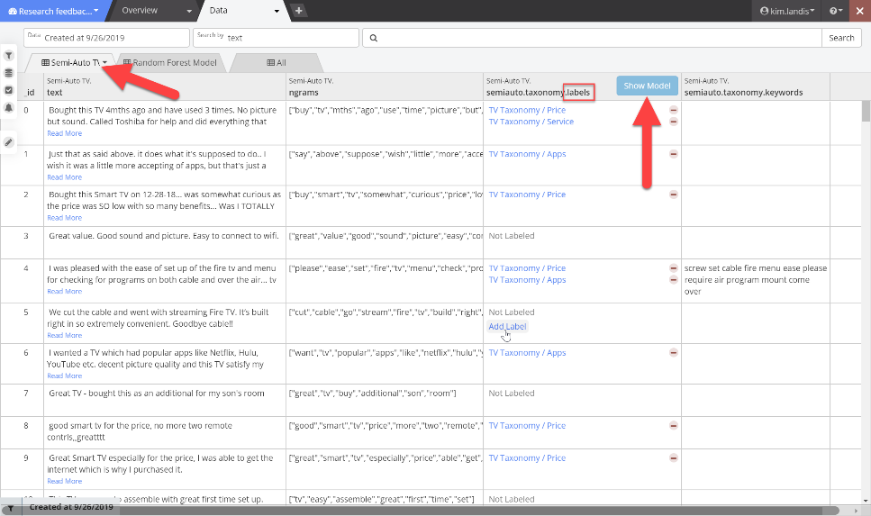
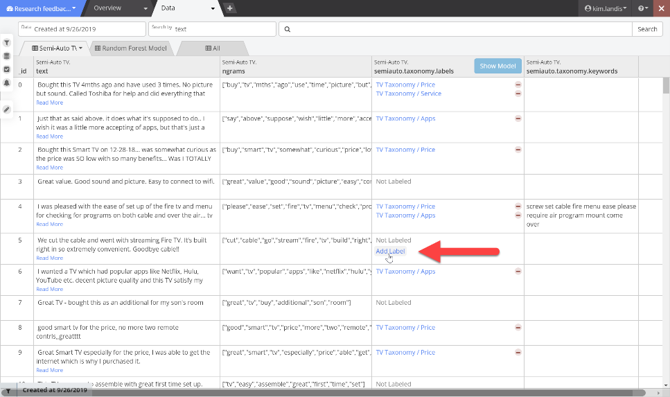
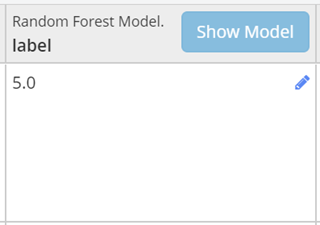
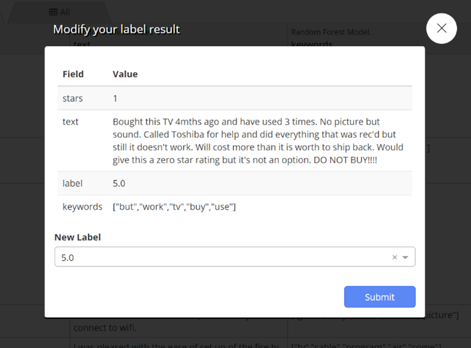
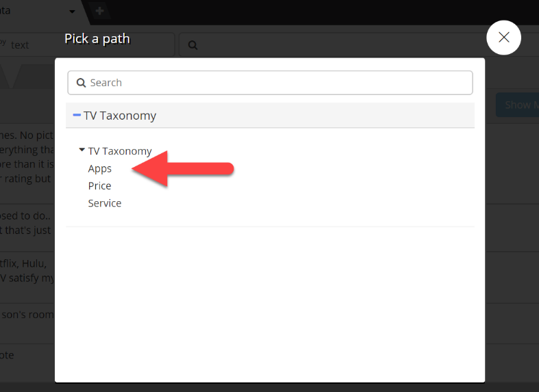
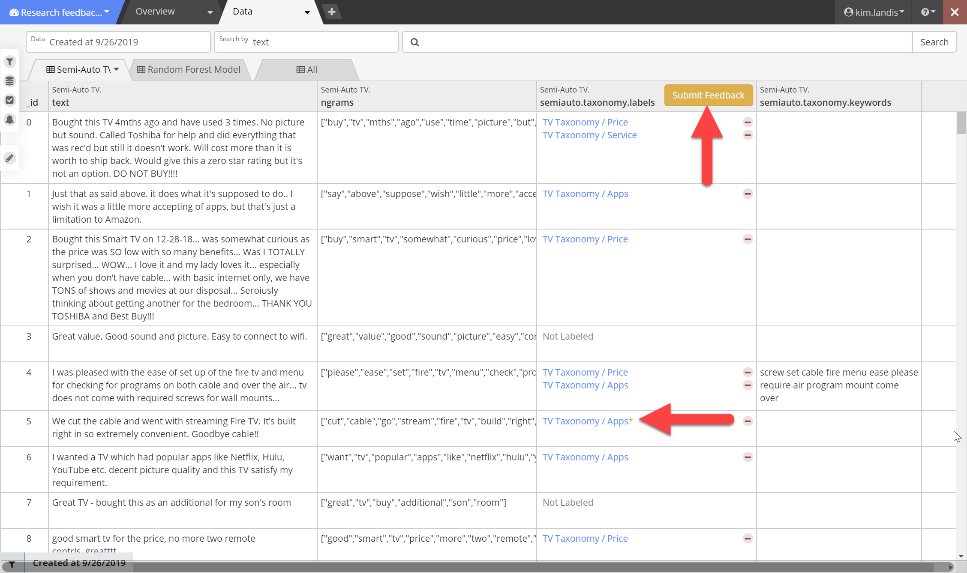
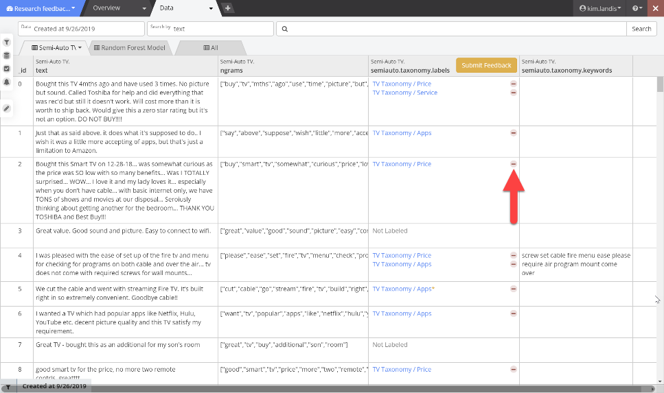
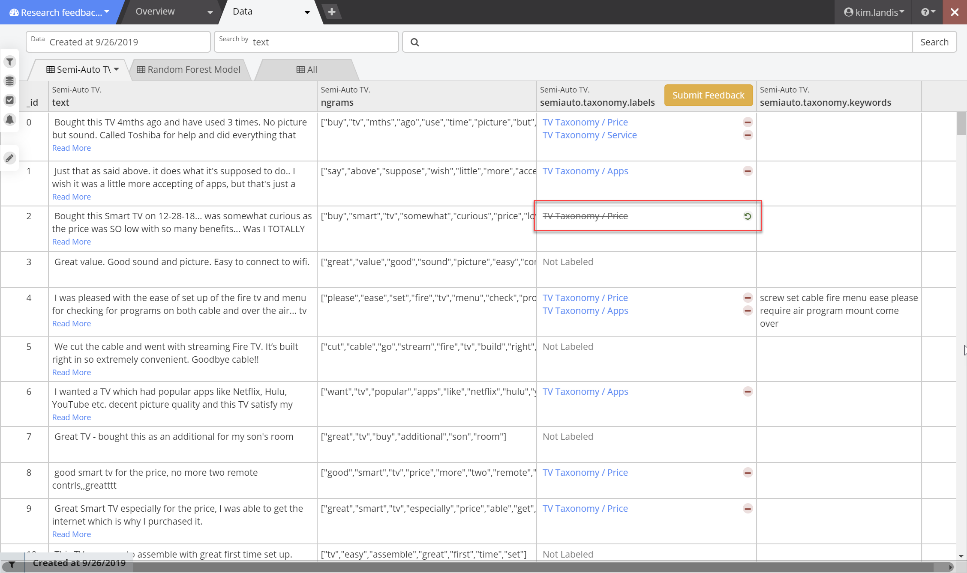

# Model Feedback Loop

## Why create feedback?

Finding enough training data to make a model accurate can be difficult, so the feedback loop helps you to improve the quality of the model incrementally. You can use the feedback loop with any Supervised models, and multiple users can create feedback for a manager to review and submit. You can schedule retraining of the model based on feedback at a convenient time.

You can incorporate feedback from multiple team members into the following types of models, and then schedule the model to retrain based on all of the feedback at a convenient time.

-	AutoLearn
-	Random Forest
-	Feedforward Neural Network
-	Logistic Regression Model
-	Semi-Automatic Taxonomy
-	Embedding attentive model
-	Support Vector Machine
-	ZSL model

Feedback takes the form of adding or removing labels, setting the sentiment value of specific words, and setting negation words that may be specific to your industry.

## To add or remove labels

1.	Open a dashboard with a supervised model that you want to train and click the **Data** tab.

    

2.	Click the tab for the model that you want to train, and in the \*.labels column (where \* is the name and type of the model), you can see the **Show Model** button, indicating that there is no unsubmitted feedback.

    

3.	Mouse over any record for which you want to add a label, and click the **Add Label** button that appears. 

    

    For other types of data, you may encounter a pencil icon instead of the **Add Label** button.
 
    

    This opens a dialog where you can modify the label.
 
    

4.	In the **Pick a path** dialog that appears, click to select the label that you want to add, or if you have many labels, use the **Search** box to find it.

    

5.	Your new label is marked with an orange asterisk, and a **Submit Feedback** button appears in the column header.

    

6.	To remove a label, click the minus sign to its right.

    

7.	A removed label is marked with strike-through text, and the minus sign becomes an undo icon.

    

## Unsaved feedback

If you are called away in the middle of providing feedback before you submit it, the feedback remains in the state in which you left it, even if you close your browser.

**One exception**: If you clear your browser cache, unsubmitted feedback is lost.

## To submit feedback

1.	In the \*.labels column header, click the **Submit Feedback** button.

2.	In the **Add new feedback** dialog, any existing feedback lists appear, and you can select one to which to add your feedback or create a new one. Click **Add to a new list**.

3.	In the dialog that appears, provide a name for the new feedback list and click **OK**.

    A message box informs you that it was added.

## How are conflicts handled?

If different people add multiple labels to a single document, all of the labels apply to the document.

**Example**:

-	Document has label A.
-	User 1 adds labels B and C.
-	User 2 adds labels D and E.
-	Document has labels A, B, C, D and E.

If a person adds a label to a document and another person removes a different label from the document, both the addition and the removal apply.

**Example**:

-	Document has labels A and B.
-	User 1 adds label C.
-	User 2 removes label A.
-	Document has labels B and C.

If a person removes a label from a comment, the removal feedback overrides any future addition unless the removal action is removed from the feedback list.

**Example**:

-	Document has labels A and B.
-	User 1 removes label A.
-	User 2 adds label A.
-	Document has label B.
-	Model owner removes User 1's feedback from the feedback list and retrains the model.
-	Document has labels A and B.

## To review feedback 

Since a number of people may be providing feedback on a single model, Stratifyd uses queuing to process all of the retraining feedback at once when it is convenient. All team members can see all of the feedback lists when submitting feedback, but only the administrator or model owner can review the list and accept or reject individual feedback items.

1.	Log in as the administrator or model owner.

2.	On the Home page, click the **Advanced** tab and select **Feedback Lists**.

3.	Here you can see any feedback lists for all models that you own. Click the feedback list tile that you want to review.

4.	In the **Edit Custom Feedback List** dialog that appears, in the **Remove from list** column to the far right, click **Remove** for any feedback that you want to remove from the list.

5.	When you have finished reviewing the feedback, click **Save**. Repeat for any additional feedback lists.

## To retrain the model

The administrator or model owner can retrain the model manually, or set up a regular schedule for retraining the model.

Because the model is locked during retraining, it is best to do this at night or on a weekend so that employees can work without disruption. During retraining, anyone trying to access the model is shown a message stating that the model is locked.

1.	From the Home page, select the **Models** tab, and click the tile of the model to retrain.

    The Model Info dialog appears.

2.	Scroll down to the **Utilized Resources** section to see all feedback lists, stopwords lists, and other resources associated with the model. Any resources marked "Newly Added" have not yet been incorporated into the model training.

3.	To immediately retrain the model, click **Retrain**.

    To set a schedule for retraining, at the top of the dialog click **Schedule Retrain**. See **Schedule retraining** for details.

4.	In the top right corner of the page, message boxes show you the progress.

5.	Once complete, the dialog replaces the "Newly Added" message with the model version number in which the resource was incorporated.
